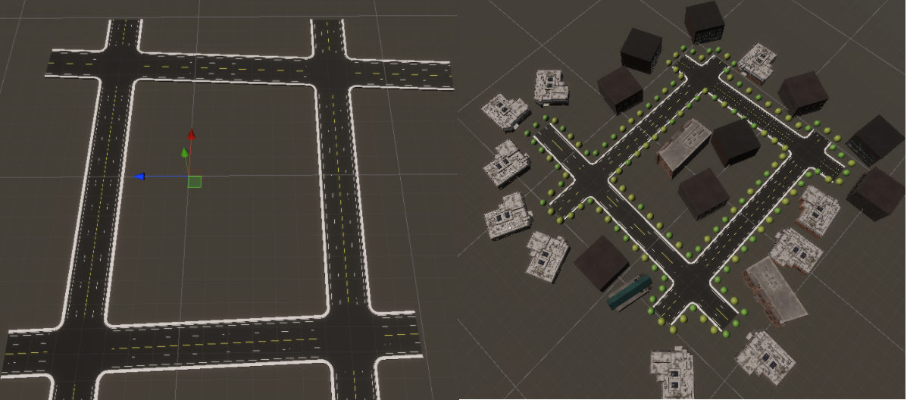

# SimViz

SimViz contains tools and resources for authoring and executing autonomous vehicle simulations on roadways and city scapes by using map import, scene creation, formatting of ground truth data, and creating spline based roads. The primary elements in this package are the OpenDRIVE importer, Spline Based Road Network, placement algorithms, ground truth output format capability, and execution of simulations on the local machine or Unity Simulation platform.

## Documentation
[Quick Installation Instructions](com.unity.simviz/Documentation~/SetupSteps.md)

[SimViz Manual](com.unity.simviz/Documentation~/simviz.md): Sample projects and documentation of the SDK.

[Creating a Open Drive Network](com.unity.simviz/Documentation~/OpenDriveNetwork.md)

[Creating a Spine Based Road Network](com.unity.simviz/Documentation~/SpineRoadNetwork.md)

## Local Development 
The repository includes two projects for local development in `TestProjects` folder, one set up for HDRP and the other for URP.

### Suggested IDE Setup
For closest standards conformity and best experience overall, JetBrains Rider or Visual Studio w/ JetBrains Resharper are suggested. For optimal experience, perform the following additional steps:
* To allow navigating to code in all packages included in your project, in your Unity Editor, navigate to `Edit -> Preferences... -> External Tools` and check `Generate all .csproj files.` 

## Citation
If you find this package useful, consider citing it using:
```
@misc{com.unity.simviz2020,
    title={Unity {S}imViz Package},
    author={{Unity Technologies}},
    howpublished={\url{https://github.com/Unity-Technologies/com.unity.simviz}},
    year={2020}
}
```
