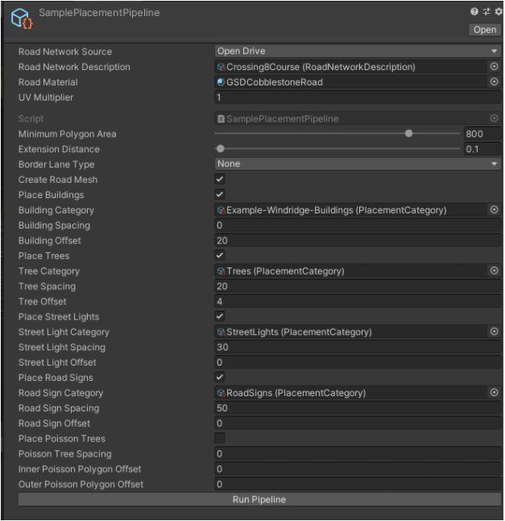
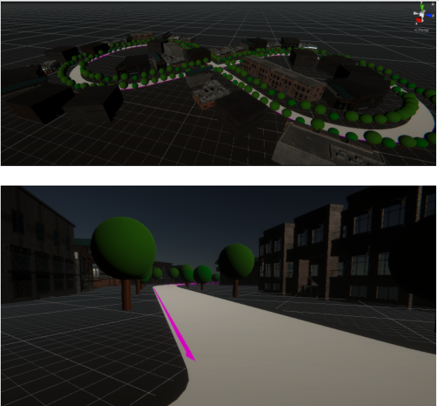
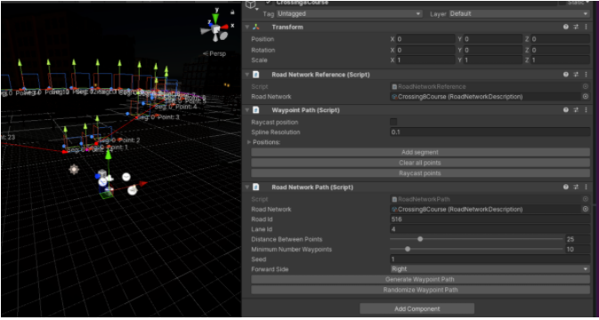
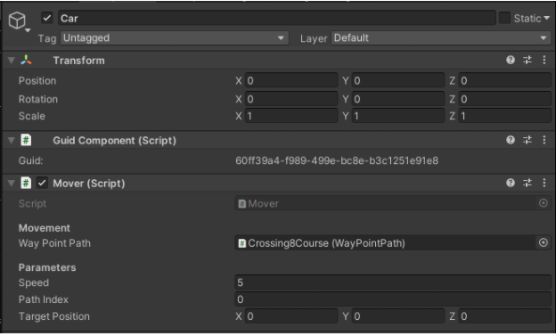
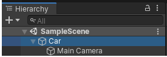
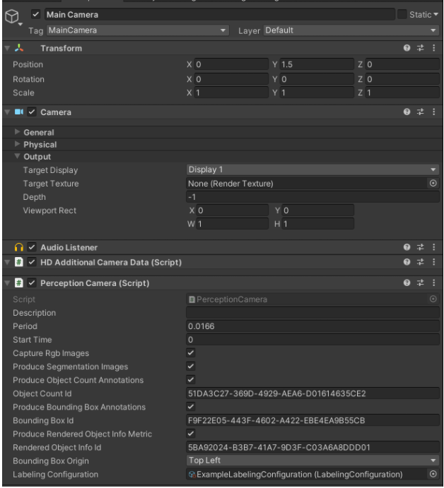
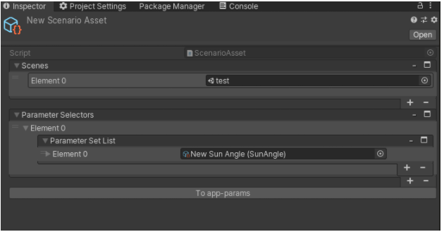
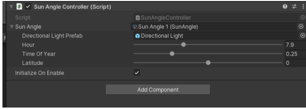

# OpenDrive Road Network

## Open the SimViz Sample project
1. Open the SimVizSampleProject inside the packagke
2. In the folder Scenes open up the Tutorial scene
	1. This is a blank scene set up and ready to go for someone to start creating all of their own assets using our sample assets
3. For reference we have added a CompleteOpenDrive scene in the Scenes folder to show a basic setup of a OpenDrive road 
	1. This scene is complete setup using the Workflow instructions listed in the current workflow
	2. All of the assets being used are located in the project, most objects live in the Simple Assets folder 
	3. Press play and watch the car drive around
	4. Ground Truth data is outputted in the root of the project folder

## Review Imported Assets 
1. Our asset importer works with specific assumptions on asset setup. Please ensure that all assets prepared for import match the requirements in the appendix of this document.

2. Inspect the provided example taxonomy file in the Assets folder called “Example.txn” by opening it from its downloaded location with a text editor. It is a JSON format file that maps the example assets we’ve provided to the asset types that are placed by our algorithms. If you want to import your own assets, you will need to modify and reimport this mapping file.

3. Right-click on Example scriptable object and select Re-import from the drop-down.

4. The assets in the provided sample pack will be imported according to the taxonomy file and scriptable objects for each of the asset categories will now be selectable in the scene creation GUI.

## Create Procedural Scene Variants 
1. From the top drop-down menu, select Assets > Create > SimViz > Content > Sample Placement Pipeline. This will create a new asset with a GUI for selecting the imported road network, selecting object categories, and defining placement parameters.

2. Select the newly-created Sample Placement Pipeline object in your project window to bring up the GUI in the Inspector window on the right. 

3. In the Inspector window, click the selector for Road Network Source and choose Open Drive in the dialog box that pops up.

4. In the Inspector window, click the selector for Road Network Description and choose Crossing8Course in the dialog box that pops up.
	1. In the simviz-mvp0-assets-master you imported previously  in step 1 find the Crossing8Course.xodr file for the next steps

5. Choose 0135_DarkGray- for the road material. This is just for visualization purposes and not intended to be used to generate training data. 

6. Choose the Example-Buildings object for Building Category, Example-Trees for Trees Category, Example-Lights for Street Light Category, and Example-RoadSigns for Road Sign Category.

7. Ensure that the box is checked for Place Buildings, Place Trees, Place Street Lights, and Place Road Signs.

8. You can pick any material for the road, for this example to show the road GSDCobblestoneRoad material was chosen.

9. The Spacing and Offset parameters are all specified in meters. Try the following values for the example road and assets we provided as a start.

10. Once all of the parameters are set, select Run Pipeline. This process may take up to a minute or more depending on the size of the road network and your computer specs. It will populate your active scene with imported objects along your road network.

11. Each time the pipeline is run, it will create a new scene, so it is best to delete the scene called Procedural Placement between each run of the pipeline. Experiment with parameter values, road networks, and assets.

## Create Ground Truth Labels for Each Asset

1. Using the Simple Assets from Step 3 used building, sign, and trees that are already labeled and ready ground truth
2. Add a label to the road mesh under Procedural Placement 
	1. Expand the game object in your Hierarchy called  Procedural Placement
	2. Select Road Mesh 
	3. In the asset Inspector window click “Add Component” button
	4. Search and place the component script “Labeling” to any game assets you want labeled in your output data 
	5. Change the Size of the “Classes” array to 1
	6. Change the Element 0 to Road  

## Create Waypoint paths 
1. In the Project window select the Crossing8Course xodr file 
2. Click on Simviz in the top menu ribbon and follow this path
	1. SimViz > Content Pipeline > Generate WaypointPath
	2. This will create a waypoint path object in your Hierarchy window named Crossing8Course 
	3. This will create a waypoint for a camera or ego car to follow
	4. Select the Crossing8Course object in your Hierarchy 
		1. Click the Generate Waypoint Path button in the inspector panel, this should create segment points
		2. Click the Add Component and add Guid Component to the object

3. In the Hierarchy window Right Click and select Create Empty
	1. Select the Object
	2. Change the name of the object to Car
	3. Make sure the transform component for position and rotation has values of 0 for a,y, and z
	4. Click the Add Component and add the Mover component script
	5. Under Movement > Waypoint Path add your newly created waypoint path called Crossing8Course 
	6. Click the Add Component and add Guid Component to the object

4. Select your main camera in the Hierarchy window and follow these steps:
	1. In the Hierarchy click the Main Camera and move the object under the Car game object you created 
		1. This will make it a child of that object

	2. In the Transform > Rotation component make sure all the values are 0
	3. In the Transform > Position component make sure all the values are the following:
		1. X = 0
		2. Y = 1.5
		3. Z = 0
	4. Add the Perception Camera script to the camera object
5. At the end of your steps your Main Camera component should look like the following figure and you can press play to have your camera drive around the segmented points.

## Create Procedural Scenario Variants
1. Right click in the Hierarchy window and select Create Empty to create an empty game object and call it Scenario Manager

2. Click on the Scenario Manager game object and click Add Component
	1. Search and place the component script called Scenario Manager
	2. Set the Execution Nodes to 5 (this only matters for the case that we run on Unity Simulation)

3. Scenes can be layered onto one another to generate variations. We will create a new test scene to act as a scenario variant. We will layer a new scene onto the existing scene we already created in the previous steps in this document. Create a new scene and save it to the project for the use of this example File > New Scene
	1. Save scene with the name of test
4. You now need to create a new Scenario Asset by clicking Assets > Create > Scenario Asset
	1. Click on the Scenario Asset you just created
	2. In the Inspector windows add the newly created scene from step 3 to the scenes list in the scenario asset

5. Lets create a Parameter Selectors for the scenario asset created in step 4 by clicking Assets > Create > Sun Angle (Note: the Sun Angle Asset was loaded as part of the SimViz package)
	1. Click on the Scenario Asset you just created
	2. In the Inspector windows add the newly created Sun Angle to the Parameter Selectors in the scenario asset
	3. Add the Directional Light prefab to the sun angle in the script of the object
		1. There is an included prefab in the Assets folder of the sample project
	4. Add the Sun Angle you created under the Parameter Set List in the Scenario asset

6. Let's create a Path Variation for the scenario asset by clicking Assets > Create > Path Variation
	1. For the Mover Object field you want to add the Car game object, this is an object we created for Ground Truth steps and has a Guid Component on the object 
	2. For the Variation field you want to add the Crossing8Course game waypoint object we created in the Ground Truth steps and has a Guid Component on the object 
	3. Add the Path Variation you created under the Parameter Set List in the Scenario asset 
7. In the Hierarchy window select the Scenario Manager game object 
	1. Locate the Scenarios list at the bottom of the Scenario Manager (Script)
	2. Click the + symbol to add a scenario 
	3. Add the new scene scenario created in step 4
8. Scenario manager was designed to produce input to be run either locally or on Unity Simulation. 
	1. Running Locally:
		1. Select “Schedule All On Initialization” under Scheduling Source to run all permutations. Press Play to run these scenario variations. 
		2. To test AppParams locally, enter number of nodes (that you want to distribute the simulations on) in the Execution Nodes field and click “Create AppParams”. Refresh the Assets folder and you should see AppParams files. Then select “Simulation Scheduler” under Scheduling Source and drag and drop the desired AppParams file on “App Params File” field. Press play to execute the permutations in the selected AppParams file.
