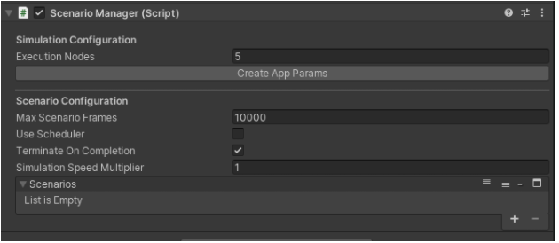
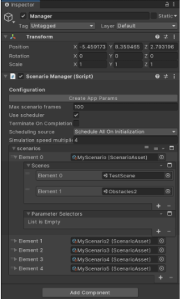
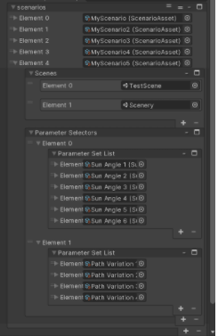

# Scenario Manager

1. We now have a new section under Scenario Manager called Simulation Configuration, which contains 
	1. Execution Nodes
	This is the number of execution nodes/instances that you want your simulations to run on. For N number of execution nodes, Scenario Manager distributes the total Permutations evenly among N AppParams files which can run on a single instance each.
	2. “Create App Params” button
	Creates the AppParams files in Asset folder.

2. The second section is renamed to “Scenario Configuration”.  

3. The “Create App Params” button creates Application Parameters files in the Assets folder. Here’s how USim uses app params. It now generates N number of app params files ( N is the number of Execution Nodes you enter in the UI), with total permutations distributed evenly. You can create app params by clicking on “Create App Params” button then refresh Assets folder.
AppParams files will be used for simulating the project on Unity Simulations.You can test the app param file inputs by selecting “Simulation Scheduler” from Scheduling Source dropdown then drag and drop the desired app params file on “App Params File” field.

4. To create scenario variants, add the scenes you want to permute through, under “Scenarios”. Each “Element” is a Scenario which contains a combination of Scenes and Parameter Selectors. For example, Element 0 - “MyScenario” will run TestScene with the Obstacles2 scene. 

5. Similarly for Element 4 (MyScenario5), it will run permutations of each Sun Angle with each Path Variation on the TestScene and Scenery scene.

6. Press Play to run these scenario variations. The scenario variations will execute all permutations one after the other when you have “Schedule All On Initialization” selected under Scheduling Source. For “Simulation Scheduler” it will only execute the permutations mentioned in the selected AppParams file under “App Params File” field.

7. What are Permutations?
	1. Each permutation is a unique combination of the Scenario and its Parameters. In the screenshot examples above, we have 
		1. 4 Scenarios with 2 different scenes each and no Parameter Selectors 
		2. 1 Scenario (Element 4) with 2 scenes and 2 Parameter Selectors. 
		3. First Parameter Selector - SunAngle has 6 different values and the second Parameter Selector - PathVariation has 4 different values.
	2. So here, the total number of permutations are: 1+1+1+1+(1*6*4) = 28 
