# Spine based road network 

## Open the SimViz Sample project
1. Open the SimVizSampleProject inside the packagke
2. In the folder Scenes open up the Tutorial scene
	1. This is a blank scene set up and ready to go for someone to start creating all of their own assets using our sample assets
3. For reference we have added a CompleteOpenDrive scene in the Scenes folder to show a basic setup of a OpenDrive road 
	1. This scene is complete setup using the Workflow instructions listed in the current workflow
	2. All of the assets being used are located in the project, most objects live in the Simple Assets folder 
	3. Press play and watch the car drive around
	4. Ground Truth data is outputted in the root of the project folder

## Review Imported Assets 
1. Our asset importer works with specific assumptions on asset setup. Please ensure that all assets prepared for import match the requirements in the appendix of this document.

2. Inspect the provided example taxonomy file in the Assets folder called “Example.txn” by opening it from its downloaded location with a text editor. It is a JSON format file that maps the example assets we’ve provided to the asset types that are placed by our algorithms. If you want to import your own assets, you will need to modify and reimport this mapping file.

3. Right-click on Example scriptable object and select Re-import from the drop-down.

4. The assets in the provided sample pack will be imported according to the taxonomy file and scriptable objects for each of the asset categories will now be selectable in the scene creation GUI.

## Creating the Spline Road Network
1. In the Hierarchy tab right click and select SimViz > Road Path Network to create a new spline based road network game object

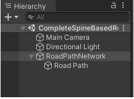

2. Select the RoadPathNetwork game object in your Hierarchy view
	1. In the Inspector menu expand the road Path Network Script
	2. Expand the Road Paths list
	3. Click the Add Road Path button until 4 road paths objects are selected

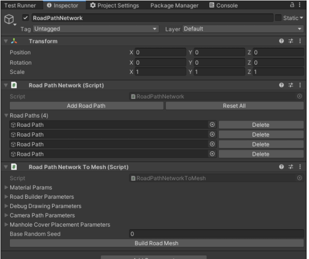

3. In the Hierarchy tab expand the RoadPathNetwork GameObject, there are now 4 Road Path objects listed as children to the parent GameObject

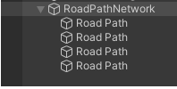

4. Examine the Road path object in the Inspector tab to configure the road path component settings, example image below

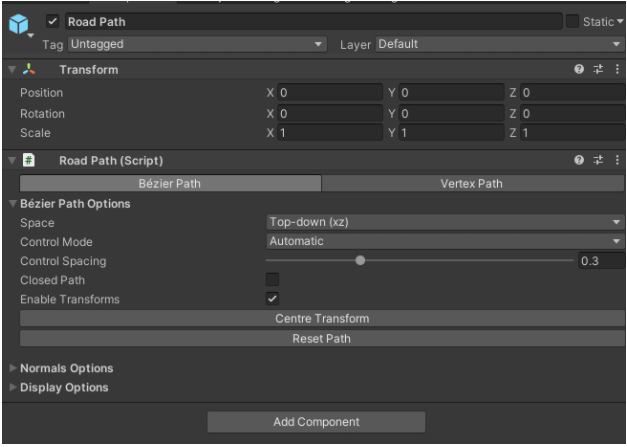

5. By selecting the 1st Road Path GameObject in the hierarchy view, a handle gizmo will appear in the scene view 

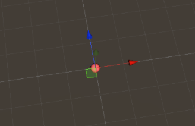

6. Drag the handles around the scene to edit the spline for the selected road 

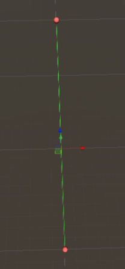

7. Move the Handles for each Road Path into the desired road network, for this example a simple # symbol will work. Make sure to make the road network large enough to leave enough space for intersections to be generated where spline paths intersect.

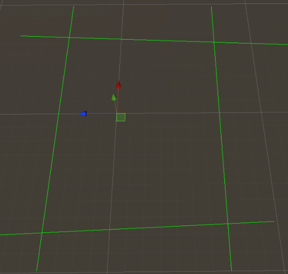

## Configure Generator Parameters 

1. Select the RoadPathNetwork GameObject in the Hierarchy tab, then expand the Road Path Network To Mesh Component in the Inspector tab

2. Expand the Material Params list to view the materials list, using the picture below assign the materials to the each category 

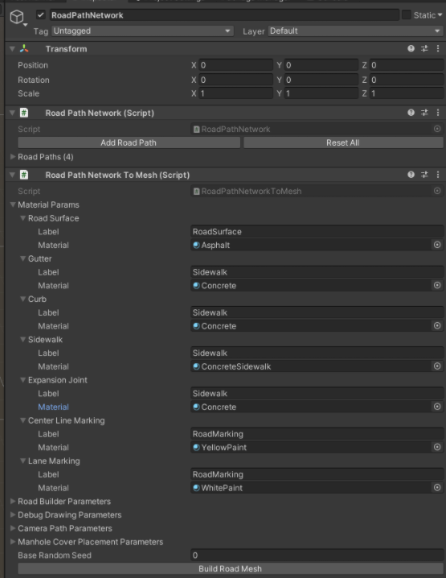

3. In the Road Network To Mesh script, click the Build Mesh button at the bottom of the script to generate your road

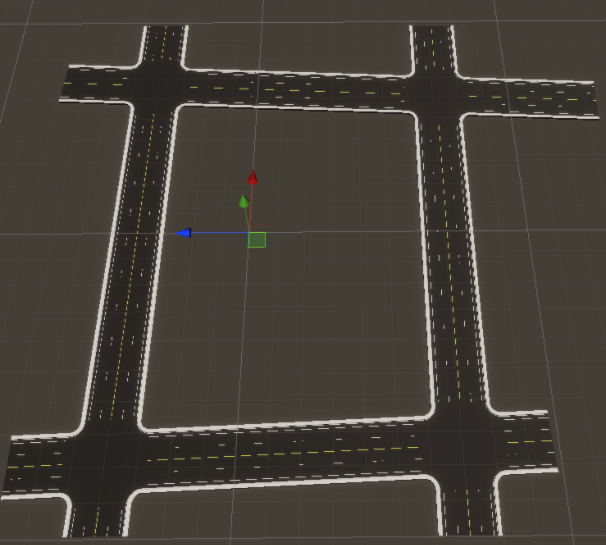

## Create Procedural Scene Variants

1. Take the RoadPathNetwork object, click and drag the object to the Project tab from the Hiearchy tab to create a prefab of your RoadPathNetwork object

2. From the top drop-down menu, select Assets > Create > SimViz > Content > Sample Placement Pipeline . This will create a new placement pipeline asset with an interface for defining object placement parameters for your road network.

3.  Select the newly-created Sample Placement Pipeline object in your project window to bring up the GUI in the Inspector window on the right.

4. In the Inspector window, click the selector for Road Network Source and choose the Spline Based option in the selection box that pops up.

5. Select the RoadPathNetwork  prefab created in Step 1 for the Spline Road Network

6. Choose the Example-Buildings object for Building Category, Example-Trees for Trees Category

7. Ensure that the box is checked for Place Buildings, Place Trees, Place Street Lights, and Place Road Signs.

8. The Spacing and Offset parameters are all specified in meters. Try the following values for the example road and assets we provided as a start.

9. Set the Building Layer Mask in Roadside Building Placement to Everything in the drop down
	1. This helps with buildings not colliding with the road or other object.
	2. Select any layers you don’t want the object to collide with, this can be down with any placement scheme in the list 

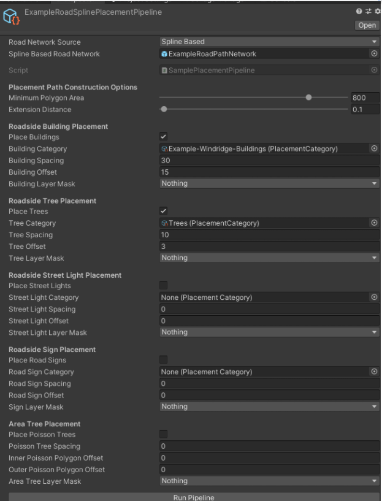

10. Once Completed click the Run Pipeline button to generate a Road with objects

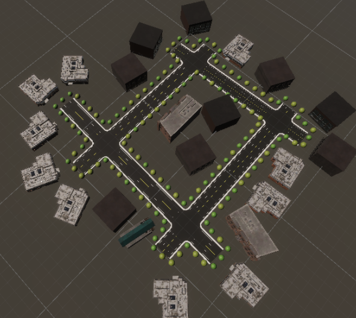

## Configure the Camera 

1. In the Hierarchy window Right Click and select Create Empty
	1. Select the Object
	2. Change the name of the object to Car
	3. Make sure the transform component for position and rotation has values of 0 for x, y, and z
	4. Click the Add Component and add the Mover component script
	5. Under Movement > Waypoint Path add your newly created waypoint path called CameraPath 
	6. Click the Add Component and add Guid Component to the object

2. Select your main camera in the Hierarchy window and follow these steps:
	1. In the Hierarchy click the Main Camera and move the object under the Car game object you created 
		1. This will make it a child of that object

	2. In the Transform > Rotation component make sure all the values are 0
	3. In the Transform > Position component make sure all the values are the following:
		1. X = 0
		2. Y = 1.5
		3. Z = 0
	4. Add the Perception Camera script to the camera object
3. At the end of your steps your Main Camera component should look like the following figure and you can press play to have your camera drive around the segmented points.

4. At the end of your steps your Main Camera component should look like the following figure and you can press play to have your camera drive through the segmented way points.